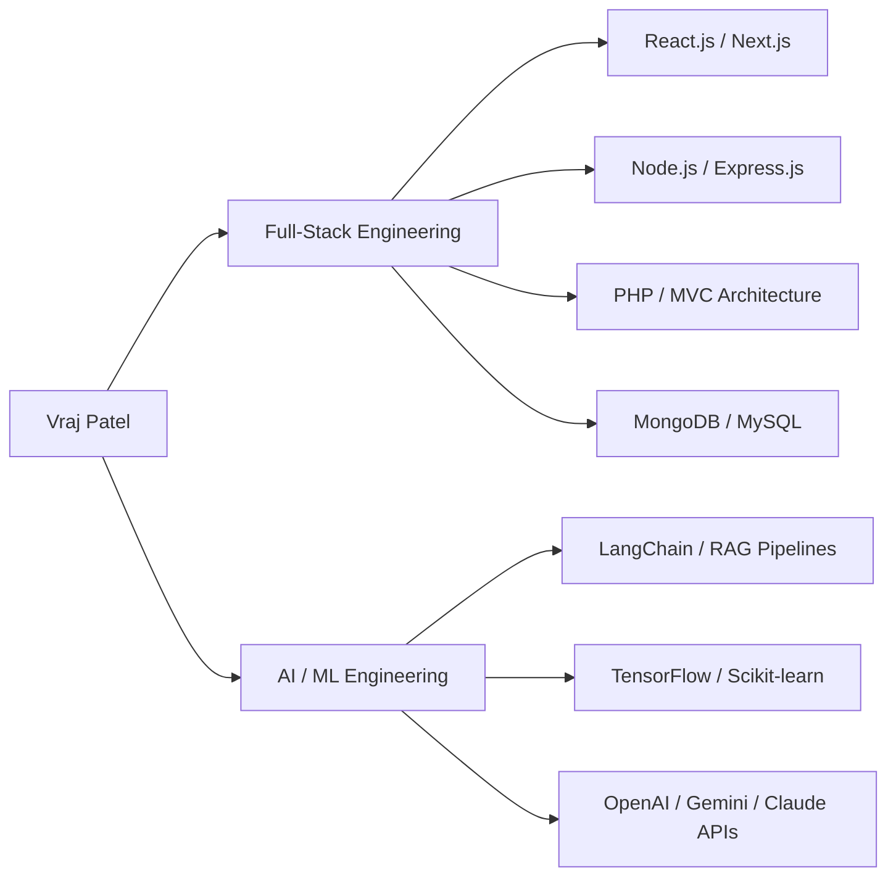

Full-stack developer and AI/ML engineer based in Ahmedabad, India. B.E. in Computer Science (2025) with hands-on experience shipping production systems — currently rebuilding a monolithic PHP billing platform into a modular MVC architecture as a Full-Stack Developer at **CSD InfoSolution**, backed by certifications in applied AI/ML.

- 🔭 I'm currently working on: **[Suched Billing System (SBS V2)](https://www.suchedbillingsystem.com/)** — a modular billing SaaS platform
- 🌱 I'm currently deepening: AI agent workflows & advanced RAG architectures
- 💬 Ask me about: RAG pipelines, LLM APIs, React/Next.js, or PHP system architecture
- ⚡ Fun fact: I can score 50 runs in a single over!

 

### 🎓 Certifications

 

### 🚧 What I'm Building

Rebuilding **[Suched Billing System (SBS V2)](https://www.suchedbillingsystem.com/)** — migrating a monolithic PHP billing platform into a modular MVC architecture. Some recent pieces:

- Designed a multi-tenant auth system around a compound `(merchant_id, email)` key to support a three-factor login flow
- Built a **Schema Synchronizer CLI** that diffs live schema against source-of-truth SQL and generates safe, additive-only migrations — never `DROP`, `TRUNCATE`, or destructive `ALTER`s
- Hardened SMTP routing and closed an SSRF gap in a test-connection endpoint; added structured, multi-channel logging across the app

 

### 📌 Featured Projects

> _Placeholder — tell me your 3-5 strongest public repos (name + link + one-liner) and I'll turn this into a proper table with live-demo links._

| Project | What it does | Stack |
|---|---|---|
| **[Project Name](#)** | One line on what it does and why it matters | — |
| **[Project Name](#)** | One line on what it does and why it matters | — |

 

### 🧠 Tech Stack

**Languages**
 
      

**Frontend**
 
         

**Backend & APIs**
 
       

**AI / ML & Data**
 
         

**Databases**
 
      

**Cloud, DevOps & Tools**
 
             

 

### 📊 GitHub Stats

 

### 🐍 Contribution Snake

<picture>
  <source media="(prefers-color-scheme: dark)" srcset="https://raw.githubusercontent.com/pvraj1011/github-stats-cards/output/github-contribution-grid-snake-dark.svg" />
  <source media="(prefers-color-scheme: light)" srcset="https://raw.githubusercontent.com/pvraj1011/github-stats-cards/output/github-contribution-grid-snake.svg" />
  
</picture>

  

### 📈 Recent Activity
<!--START_SECTION:activity-->
<!--END_SECTION:activity-->

 

### 🌐 Connect With Me

